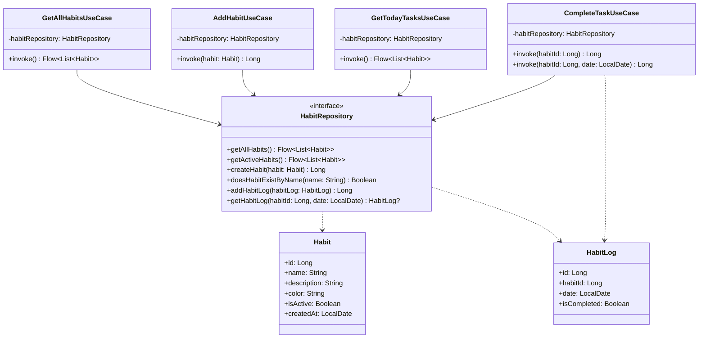

# Architecture

This document describes the layered architecture adopted for the Habit Tracker application.

## Table of Contents

- [Overview](#overview)
- [Logging Strategy](#logging-strategy)
- [Layer Responsibilities](#layer-responsibilities)
  - [Presentation Layer](#presentation-layer)
  - [Domain Layer](#domain-layer)
  - [Data Layer](#data-layer)
- [Dependency Flow](#dependency-flow)
- [Dependency Injection](#dependency-injection)
- [Benefits of This Architecture](#benefits-of-this-architecture)
- [Notification Feature](#notification-feature)
- [Update History](#update-history)

## Overview

The Habit Tracker follows a **three-layer architecture** pattern that ensures clear separation of concerns, maintainability, and testability. The architecture is designed to support both Android and iOS platforms through Kotlin Multiplatform.

```
┌─────────────────────────────────────┐
│          Presentation Layer         │
│     (UI, ViewModels, Navigation)    │
└─────────────────────────────────────┘
                    │
                    ▼
┌─────────────────────────────────────┐
│            Domain Layer             │
│   (Business Logic, Use Cases,       │
│    Entities, Repository Interfaces) │
└─────────────────────────────────────┘
                    │
                    ▼
┌─────────────────────────────────────┐
│             Data Layer              │
│  (Repositories, Data Sources,       │
│   Database, Network, Mappers)       │
└─────────────────────────────────────┘
```

## Logging Strategy

The application uses **Napier** for cross-platform logging. See `/docs/CODING_STANDARDS.md` for detailed logging guidelines and examples.

## Layer Responsibilities

### Presentation Layer
**Package**: `com.nagopy.kmp.habittracker.presentation`

The presentation layer is responsible for handling user interface and user interactions. It contains:

- **UI Components**: Compose UI components and screens
- **ViewModels**: Hold UI state and handle user actions
- **Navigation**: Routing between different screens with platform-specific gesture support
- **State Management**: Managing UI state using Compose state APIs

**Navigation Features:**
- **Cross-Platform Routing**: Screen-to-screen navigation through `HabitTrackerNavigation`
- **Smooth Animations**: Slide transitions between screens
- **iOS Swipe Back**: Native-style edge swipe gesture for iOS users using `SwipeBackHandler`
- **Safe Navigation**: Debounced navigation to prevent rapid state changes
- **Platform Consistency**: Unified navigation experience across Android and iOS

**Key Principles:**
- ViewModels communicate with the domain layer through use cases
- UI components are stateless and reactive
- No direct access to data sources or business logic

#### MVVM Architecture

The presentation layer follows the **Model-View-ViewModel (MVVM)** architectural pattern:

**Model**: Represented by domain entities (Habit, HabitLog, Task) and use cases that encapsulate business logic.

**Habit vs Task Distinction**:
- **Habit**: The rule or template that defines what should be done and when (e.g., "Drink water every hour")
- **Task**: A specific instance of a habit at a scheduled time on a specific date (e.g., "Drink water at 10:00 AM on 2024-01-20")

**View**: Compose UI screens that display data and capture user interactions. Views are stateless and declarative.

**ViewModel**: Intermediary between View and Model that:
- Holds and manages UI state
- Handles user actions and business logic coordination
- Communicates with the domain layer through use cases
- Survives configuration changes
- Provides reactive state updates to the UI

#### ViewModels

**HabitListViewModel**:
- **Purpose**: Manages the state of the habit list screen
- **Dependencies**: `GetAllHabitsUseCase`
- **State**: `HabitListUiState` containing habits list, loading state, and error state
- **Key Functions**:
  - `loadHabits()`: Fetches habits from the domain layer
  - `refresh()`: Reloads the habits list
- **State Flow**: Exposes UI state as `StateFlow<HabitListUiState>`

**TodayViewModel**:
- **Purpose**: Manages the state of today's tasks screen
- **Dependencies**: `GetTodayTasksUseCase`, `CompleteTaskUseCase`
- **State**: `TodayUiState` containing task instances, loading state, and error state
- **Key Functions**:
  - `loadTasks()`: Fetches today's task instances from habits
  - `completeTask(Task)`: Marks a specific task instance as completed
  - `refresh()`: Reloads the tasks list
- **State Flow**: Exposes UI state as `StateFlow<TodayUiState>`

**HabitEditViewModel**:
- **Purpose**: Manages the state of the habit add/edit form
- **Dependencies**: `AddHabitUseCase`
- **State**: `HabitEditUiState` containing form fields, validation errors, and save state
- **Key Functions**:
  - `updateName(String)`: Updates habit name with validation
  - `updateDescription(String)`: Updates habit description
  - `updateColor(String)`: Updates selected color
  - `updateIsActive(Boolean)`: Updates active status
  - `saveHabit()`: Validates and saves the habit
  - `clearErrors()`: Clears validation and save errors
- **Validation**: Real-time form validation with error messaging
- **State Flow**: Exposes UI state as `StateFlow<HabitEditUiState>`

#### UI Screens

**HabitListScreen**:
- **File**: `presentation/habitlist/HabitListScreen.kt`
- **Purpose**: Displays all user habits in a scrollable list
- **Features**:
  - Loading states with progress indicators
  - Error states with retry functionality
  - Empty states with user guidance
  - Material Design 3 components
  - Floating action button for adding habits
- **Parameters**: Navigation callbacks and ViewModel injection

**TodayScreen**:
- **File**: `presentation/today/TodayScreen.kt`
- **Purpose**: Displays today's scheduled task instances with time-based organization
- **Features**:
  - Time-sorted task list showing scheduled times
  - Individual completion checkboxes for each task instance
  - Visual indicators for habit colors and completion status
  - Support for multiple instances of the same habit at different times
  - Real-time task completion updates
- **Parameters**: ViewModel injection for task management

**HabitEditScreen**:
- **File**: `presentation/habitedit/HabitEditScreen.kt`
- **Purpose**: Form interface for creating and editing habits
- **Features**:
  - Form validation with inline error messages
  - Color selection palette
  - Real-time input validation
  - Save/cancel navigation
  - Loading states during save operations
- **Parameters**: Navigation callbacks and ViewModel injection

#### State Management

**UI State Pattern**: Each screen has a corresponding UI state data class:

```kotlin
// Example UI State structure
data class HabitListUiState(
    val habits: List<Habit> = emptyList(),
    val isLoading: Boolean = false,
    val error: String? = null
)
```

**Reactive Updates**: UI components observe state changes through `collectAsState()` and automatically recompose when state updates.

**Unidirectional Data Flow**: 
1. User interactions trigger ViewModel functions
2. ViewModel updates internal state
3. UI observes state changes and recomposes
4. ViewModel communicates with domain layer through use cases

#### Dependency Injection

ViewModels are registered in the `presentationModule` Koin module:

```kotlin
val presentationModule = module {
    viewModel { HabitListViewModel(get()) }
    viewModel { HabitEditViewModel(get()) }
}
```

Use cases are automatically injected through Koin's dependency resolution, maintaining separation between presentation and domain layers.

### Domain Layer
**Package**: `com.nagopy.kmp.habittracker.domain`

The domain layer contains the core business logic and domain entities. It's completely independent of external frameworks and platforms. It includes:

- **Entities**: Core business models (Habit, HabitLog, Task, etc.)
- **Use Cases**: Encapsulate specific business operations and provide a clean interface for the presentation layer
- **Repository Interfaces**: Define contracts for data access without implementation details
- **Domain Services**: Complex business logic that doesn't belong to a specific entity

**Key Domain Models:**

**Habit**: Represents a habit template with scheduling information
- Contains basic habit information (name, description, color, active status)
- Includes scheduling configuration (frequency type, interval hours, scheduled times)
- Supports different frequency types: ONCE_DAILY, HOURLY, INTERVAL

**Task**: Represents a specific instance of a habit scheduled for a particular time
- Generated dynamically from habit scheduling configuration
- Contains habit details, scheduled date/time, and completion status
- Provides the specific "what to do when" for the user interface

**HabitLog**: Tracks completion status for habits by date
- Currently stores completion by date (not by specific time)
- Supports the task generation logic for determining completion status

**Repository Pattern:**
The Repository pattern provides an abstraction layer between the business logic and data access layers. The `HabitRepository` interface defines all operations needed for habit management without exposing implementation details. This allows for easy testing with mock implementations and flexibility to change data sources.

**Use Cases:**
Use cases encapsulate specific business operations and ensure a single responsibility principle:

- **GetAllHabitsUseCase**: Retrieves all habits from the repository
- **AddHabitUseCase**: Creates a new habit with validation and business rules
- **GetTodayTasksUseCase**: Generates task instances from active habits based on their scheduling configuration for today
- **CompleteTaskUseCase**: Marks a task as completed (creates a habit log entry for the habit and date)
- **SetupDefaultHabitsUseCase**: Creates default habits for new users (e.g., "水を飲む" with 30-minute intervals) if they don't already exist

**Task Generation Logic:**
The `GetTodayTasksUseCase` implements sophisticated logic to generate task instances:
- **ONCE_DAILY**: Creates one task per scheduled time
- **HOURLY**: Creates tasks every hour starting from the first scheduled time
- **INTERVAL**: Creates tasks every N hours based on the interval configuration

**Key Principles:**
- Pure Kotlin with no platform-specific dependencies
- Contains the application's business rules
- Defines interfaces that outer layers must implement
- Independent and testable
- Use cases provide clear business operations that can be easily tested in isolation
- Clear separation between habit templates (rules) and task instances (execution)

**Testing Infrastructure:**
The application uses a comprehensive testing approach across all layers:

**Domain Layer Testing:**
- **MockK**: Kotlin-native mocking library used to create mock implementations of repository interfaces
- **kotlin.test**: Test framework providing assertion methods and test structure
- **kotlinx-coroutines-test**: Testing utilities for coroutines and Flow operations
- **Test Isolation**: Each use case is tested independently with mocked dependencies, ensuring true unit testing

**Data Layer Testing:**
- **Repository Implementation Tests**: Full test coverage of `HabitRepositoryImpl` with mocked DAO dependencies
- **Mapper Tests**: Comprehensive testing of data transformation logic including edge cases and error handling
- **Database Tests**: Android-specific tests using Room's testing utilities with in-memory database

**Presentation Layer Testing:**
- **ViewModel Tests**: All ViewModels tested with mocked use case dependencies
- **UI State Testing**: Verification of state management and user interaction handling

MockK provides superior type safety and Kotlin-specific features compared to manual mock implementations, including support for suspend functions, extension functions, and proper coroutine handling.

#### Domain Layer Class Diagram



### Data Layer
**Package**: `com.nagopy.kmp.habittracker.data`

The data layer is responsible for data access and storage. It implements the repository interfaces defined in the domain layer. It contains:

- **Repository Implementations**: Concrete implementations of domain repository interfaces
- **Data Sources**: Local (Room database) and remote (API) data sources
- **Database Entities**: Room database entities and DAOs
- **Data Mappers**: Convert between data models and domain entities
- **Network Models**: DTOs for API communication

#### Room Database Implementation

The local data persistence is implemented using **Room** for Kotlin Multiplatform:

**Room Entities:**
- `HabitEntity`: Represents habits in the database with fields for name, description, color, and creation date
- `LogEntity`: Represents habit completion logs with foreign key relationship to habits

**Data Access Object (DAO):**
- `HabitDao`: Provides CRUD operations for both habits and habit logs
- Includes methods for creating, reading, updating, and deleting habits
- Supports querying habit logs by date ranges and completion status
- Uses Flow for reactive data updates

**Database Class:**
- `AppDatabase`: Room database configuration with entities and version management
- Provides access to DAOs through abstract methods

**Repository Implementation:**
- `HabitRepositoryImpl`: Implements the domain layer's `HabitRepository` interface
- Uses `HabitDao` for database operations
- Converts between data entities and domain models using mapper functions
- Provides reactive data streams through Kotlin Flow

**Key Principles:**
- Implements domain repository interfaces
- Handles data persistence and caching
- Manages different data sources (local vs remote)
- Maps between data models and domain entities
- Uses Room annotations for type-safe database access
- Implements foreign key relationships with cascade delete

## Dependency Flow

The dependency flow follows the **Dependency Inversion Principle**:

1. **Presentation** depends on **Domain** (through use cases and repository interfaces)
2. **Domain** has no dependencies on outer layers
3. **Data** depends on **Domain** (implements repository interfaces)

This ensures that:
- Business logic is isolated and testable
- UI changes don't affect business logic
- Data source changes don't affect business logic
- Platform-specific code is kept separate

## Dependency Injection

The application uses **Koin** for dependency injection, which provides:

- Lightweight and easy-to-use DI framework
- Support for Kotlin Multiplatform
- Clear separation of concerns
- Easy testing with mock dependencies

Each layer has its own DI module:
- `PresentationModule`: ViewModels and UI-related dependencies
- `DomainModule`: Use cases and business logic dependencies
- `DataModule`: Repositories, data sources, and database dependencies

### Dependency Injection Patterns

**Constructor Injection (Preferred):**
The application consistently uses constructor injection for explicit dependency declaration:

```kotlin
// Example: Notification scheduler with explicit dependencies
class AndroidNotificationScheduler(
    private val context: Context,
    private val habitRepository: HabitRepository
) : NotificationScheduler

// Koin module configuration
val androidNotificationModule = module {
    single<NotificationScheduler> { AndroidNotificationScheduler(androidContext(), get()) }
}
```

**Benefits of Constructor Injection:**
- **Explicit Dependencies**: All dependencies are clearly visible in the constructor
- **Immutability**: Dependencies are injected once and remain immutable
- **Testability**: Easy to provide mock dependencies for unit testing
- **Compile-time Safety**: Missing dependencies cause compilation errors rather than runtime failures

**Platform Consistency:**
Both Android and iOS notification schedulers use the same constructor injection pattern:
- Ensures consistent dependency management across platforms
- Simplifies maintenance and reduces cognitive load
- Enables shared testing patterns and mock strategies

**Dependency Resolution:**
- Koin automatically resolves dependencies through `get()` calls in module definitions
- Type-safe dependency injection prevents runtime injection errors
- Circular dependency detection helps maintain clean architecture

### Module Organization

**Platform-Specific Modules:**
```kotlin
// Common interface
expect val notificationModule: Module

// Android implementation
actual val notificationModule: Module = androidNotificationModule

// iOS implementation  
actual val notificationModule: Module = iosNotificationModule
```

This pattern ensures platform-specific implementations while maintaining a unified interface for the common application module.

### Platform-Specific UI Components

The application extends the `expect/actual` pattern to UI components for platform-specific behavior:

**SwipeBackHandler Implementation:**
```kotlin
// Common interface (commonMain)
@Composable
expect fun SwipeBackHandler(
    enabled: Boolean = true,
    onSwipeBack: () -> Unit,
    content: @Composable () -> Unit
)

// iOS implementation (iosMain)
actual fun SwipeBackHandler(...) {
    // iOS-specific gesture detection with edge swipe
}

// Android implementation (androidMain)  
actual fun SwipeBackHandler(...) {
    // Defers to system gesture navigation
}
```

**Benefits of UI Component expect/actual Pattern:**
- **Platform Optimization**: Each platform gets the most appropriate implementation
- **Unified Interface**: Common code can use the same API across platforms
- **Maintainability**: Platform-specific behavior is encapsulated in respective modules
- **Native Experience**: Users get platform-appropriate interactions (iOS edge swipe, Android system gestures)

## Benefits of This Architecture

1. **Separation of Concerns**: Each layer has a single responsibility
2. **Testability**: Each layer can be tested independently
3. **Maintainability**: Changes in one layer don't affect others
4. **Scalability**: Easy to add new features without breaking existing code
5. **Platform Independence**: Business logic works on both Android and iOS
6. **Clean Dependencies**: Clear dependency flow prevents circular dependencies

## Notification Feature

The notification system is implemented following the same clean architecture principles, with platform-specific implementations for Android and iOS.

### Design Overview

The notification feature separates the shared interface from platform-specific implementations:

```
┌─────────────────────────────────────┐
│            Domain Layer             │
│   NotificationScheduler Interface   │
│   ManageNotificationsUseCase        │
│   CompleteTaskFromNotificationUC    │
└─────────────────────────────────────┘
                    │
          ┌─────────┴─────────┐
          ▼                   ▼
┌──────────────────┐ ┌──────────────────┐
│   Android Layer  │ │    iOS Layer     │
│ AndroidNotif...  │ │ IOSNotif...      │
│ NotificationAct..│ │ UNNotifications  │
└──────────────────┘ └──────────────────┘
```

**Key Components:**

**NotificationScheduler Interface** (Domain Layer):
- Defines platform-agnostic contracts for notification operations
- Methods for scheduling, canceling, and managing notification permissions
- Ensures consistent behavior across platforms

**Platform Implementations:**
- **Android**: Uses `AlarmManager` and `NotificationManager` for precise scheduling
- **iOS**: Uses `UserNotifications` framework for native iOS notification experience
- Both implementations handle platform-specific permission models and UI patterns

**Use Cases:**
- `ManageNotificationsUseCase`: Orchestrates notification scheduling for tasks
- `CompleteTaskFromNotificationUseCase`: Handles task completion from notification actions

### Processing Flow for Interactive Notifications

#### Scheduling Flow:
1. **Task Generation**: `GetTodayTasksUseCase` creates task instances from habit schedules
2. **Notification Scheduling**: `ManageNotificationsUseCase` filters pending tasks and schedules notifications
3. **Platform Scheduling**: Platform-specific schedulers use native APIs to set up timed notifications
4. **Permission Handling**: Each platform manages notification permissions according to OS requirements

#### Completion Flow:
1. **User Interaction**: User taps "Complete" action in notification
2. **Platform Handler**: 
   - **Android**: `NotificationActionReceiver` captures broadcast intent
   - **iOS**: `UNUserNotificationCenterDelegate` handles notification response
3. **Business Logic**: `CompleteTaskFromNotificationUseCase` executes completion logic
4. **State Update**: Task marked as completed using existing `CompleteTaskUseCase`
5. **Cleanup**: Notification automatically canceled to prevent duplication

#### Architecture Benefits:

**Separation of Concerns:**
- Domain layer contains pure business logic for notification management
- Platform layers handle OS-specific implementation details
- UI components remain unaware of notification implementation

**Cross-Platform Consistency:**
- Same notification behavior across Android and iOS
- Unified API through shared interface
- Platform-specific optimizations while maintaining consistency

**Testability:**
- Domain logic fully testable with mocked notification scheduler
- Platform implementations can be tested independently
- Business rules isolated from platform-specific code

**Maintainability:**
- Easy to add new notification features without affecting other layers
- Platform-specific changes contained to respective implementation layers
- Clear dependency injection pattern for easy configuration

### Notification Content Strategy

The notification system ensures that push notifications always display current, up-to-date habit information, even when habit details have changed since tasks were originally scheduled.

### Sequential Notification Scheduling Architecture

The application implements a **sequential notification scheduling** system that replaces traditional batch scheduling with a more efficient, chain-based approach.

#### Architecture Overview

The sequential notification system follows this pattern:
```
Initial Schedule → Alarm → Receiver (Display & Re-schedule) → Next Alarm → ...
```

**Key Components:**

1. **ScheduleNextNotificationUseCase**: Finds and schedules only the next upcoming notification for a habit
2. **GetNextTasksUseCase**: Locates the next upcoming task across all active habits
3. **Enhanced BroadcastReceivers**: After displaying a notification, automatically schedule the next one
4. **Boot Completion Handling**: Reschedules notifications after device restart

#### Implementation Flow

**Initial Scheduling:**
1. When app starts or habits are created/edited
2. `ScheduleNextNotificationUseCase.rescheduleAllHabitNotifications()` is called
3. Only the next upcoming notification for each habit is scheduled
4. No past notifications are scheduled

**Notification Chain:**
1. `AlarmManager` triggers notification at scheduled time
2. `AlarmReceiver` displays the notification
3. Immediately calls `ScheduleNextNotificationUseCase.scheduleNextNotificationForHabit()`
4. Next notification in sequence is scheduled
5. Chain continues automatically

**Device Restart Handling:**
1. `BootCompletedReceiver` detects system boot completion
2. Calls `ScheduleNextNotificationUseCase.rescheduleAllHabitNotifications()`
3. Notification chains are restored for all active habits

#### Key Benefits

**Efficiency:**
- Only one notification per habit scheduled at any time
- No wasted resources on past notifications
- Automatic scheduling without user intervention

**Reliability:**
- Notifications continue across day boundaries automatically
- Device restart protection ensures continuous operation
- No dependency on app being opened daily

**Scalability:**
- Memory usage constant regardless of habit frequency
- System alarm slots used efficiently
- Performance remains consistent as habits grow

#### Platform-Specific Implementation

**Android:**
- `AlarmReceiver` enhanced with sequential scheduling logic
- `BootCompletedReceiver` handles device restart scenarios
- Uses existing `AlarmManager` infrastructure

**iOS:**
- `IOSNotificationScheduler.handleNotificationResponse()` enhanced
- Leverages `UNUserNotificationCenter` for scheduling
- App launch after restart triggers rescheduling

#### Testing Strategy

**Unit Tests:**
- `GetNextTasksUseCaseTest`: Verifies next task finding logic
- `ScheduleNextNotificationUseCaseTest`: Tests sequential scheduling behavior
- Mock-based testing ensures isolation from platform specifics

**Integration Considerations:**
- Existing notification tests updated to verify sequential behavior
- ViewModel tests confirm proper use of new scheduling approach
- End-to-end testing validates complete notification chains

#### Implementation Details

**Data Fetching Pattern:**
Both iOS and Android notification schedulers fetch current habit data at notification scheduling time:

```kotlin
// Example implementation pattern used in both platforms
val habit = habitRepository.getHabit(task.habitId)
val habitName = habit?.name ?: task.habitName
val habitDescription = habit?.description ?: task.habitDescription
```

**Fallback Strategy:**
- **Primary Source**: Current habit data fetched from `HabitRepository`
- **Fallback Source**: Task data (preserves existing functionality if habit lookup fails)
- **Error Handling**: Graceful degradation ensures notifications are always delivered

**Dependency Injection:**
- **Android**: Constructor injection of `HabitRepository` via Koin module
- **iOS**: Constructor injection pattern matching Android for consistency
- **Shared Pattern**: Both platforms use the same DI approach for maintainability

#### Performance Considerations

**Database Access:**
- Notification schedulers now perform database lookups during scheduling
- Impact is minimal as scheduling typically happens during off-peak periods
- Repository calls are suspend functions supporting proper coroutine handling

**Caching Strategy:**
- No additional caching implemented as habit data changes are infrequent
- Repository layer handles any necessary caching optimizations
- Task fallback data ensures robustness even if repository is temporarily unavailable

#### Design Benefits

**Data Consistency:**
- Notifications always reflect current habit names and descriptions
- Eliminates user confusion from stale notification content
- Maintains data integrity across the entire application

**Backward Compatibility:**
- Fallback to task data preserves existing behavior if needed
- No breaking changes to existing notification functionality
- Graceful handling of edge cases (deleted habits, repository errors)

**Testing Coverage:**
- Comprehensive test suite verifies current data fetching logic
- Tests ensure fallback behavior works correctly
- Isolated testing of notification scheduler dependencies

## Platform Targets
- **Android**: Min SDK 24, Target SDK 34, JVM 11
- **iOS**: iosX64, iosArm64, iosSimulatorArm64 with static framework

## Update History
- 2025-06-21: Removed redundant technology stack (see CLAUDE.md for tech stack)
- 2025-06-21: Simplified logging section to reference CODING_STANDARDS.md