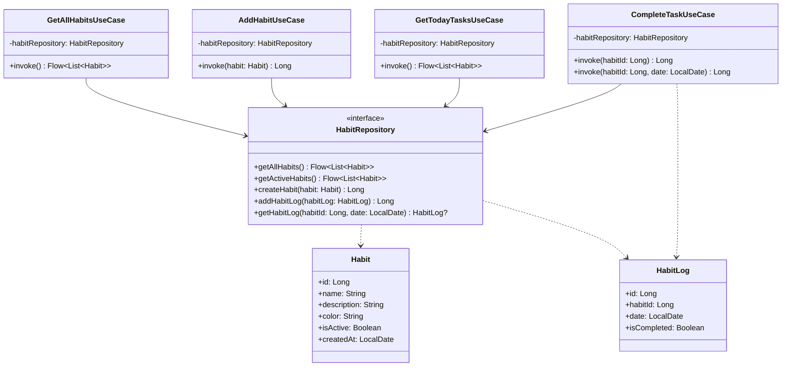

# Architecture

This document describes the layered architecture adopted for the Habit Tracker application.

## Overview

The Habit Tracker follows a **three-layer architecture** pattern that ensures clear separation of concerns, maintainability, and testability. The architecture is designed to support both Android and iOS platforms through Kotlin Multiplatform.

```
┌─────────────────────────────────────┐
│          Presentation Layer         │
│     (UI, ViewModels, Navigation)    │
└─────────────────────────────────────┘
                    │
                    ▼
┌─────────────────────────────────────┐
│            Domain Layer             │
│   (Business Logic, Use Cases,       │
│    Entities, Repository Interfaces) │
└─────────────────────────────────────┘
                    │
                    ▼
┌─────────────────────────────────────┐
│             Data Layer              │
│  (Repositories, Data Sources,       │
│   Database, Network, Mappers)       │
└─────────────────────────────────────┘
```

## Layer Responsibilities

### Presentation Layer
**Package**: `com.nagopy.kmp.habittracker.presentation`

The presentation layer is responsible for handling user interface and user interactions. It contains:

- **UI Components**: Compose UI components and screens
- **ViewModels**: Hold UI state and handle user actions
- **Navigation**: Routing between different screens
- **State Management**: Managing UI state using Compose state APIs

**Key Principles:**
- ViewModels communicate with the domain layer through use cases
- UI components are stateless and reactive
- No direct access to data sources or business logic

#### MVVM Architecture

The presentation layer follows the **Model-View-ViewModel (MVVM)** architectural pattern:

**Model**: Represented by domain entities (Habit, HabitLog) and use cases that encapsulate business logic.

**View**: Compose UI screens that display data and capture user interactions. Views are stateless and declarative.

**ViewModel**: Intermediary between View and Model that:
- Holds and manages UI state
- Handles user actions and business logic coordination
- Communicates with the domain layer through use cases
- Survives configuration changes
- Provides reactive state updates to the UI

#### ViewModels

**HabitListViewModel**:
- **Purpose**: Manages the state of the habit list screen
- **Dependencies**: `GetAllHabitsUseCase`
- **State**: `HabitListUiState` containing habits list, loading state, and error state
- **Key Functions**:
  - `loadHabits()`: Fetches habits from the domain layer
  - `refresh()`: Reloads the habits list
- **State Flow**: Exposes UI state as `StateFlow<HabitListUiState>`

**HabitEditViewModel**:
- **Purpose**: Manages the state of the habit add/edit form
- **Dependencies**: `AddHabitUseCase`
- **State**: `HabitEditUiState` containing form fields, validation errors, and save state
- **Key Functions**:
  - `updateName(String)`: Updates habit name with validation
  - `updateDescription(String)`: Updates habit description
  - `updateColor(String)`: Updates selected color
  - `updateIsActive(Boolean)`: Updates active status
  - `saveHabit()`: Validates and saves the habit
  - `clearErrors()`: Clears validation and save errors
- **Validation**: Real-time form validation with error messaging
- **State Flow**: Exposes UI state as `StateFlow<HabitEditUiState>`

#### UI Screens

**HabitListScreen**:
- **File**: `presentation/habitlist/HabitListScreen.kt`
- **Purpose**: Displays all user habits in a scrollable list
- **Features**:
  - Loading states with progress indicators
  - Error states with retry functionality
  - Empty states with user guidance
  - Material Design 3 components
  - Floating action button for adding habits
- **Parameters**: Navigation callbacks and ViewModel injection

**HabitEditScreen**:
- **File**: `presentation/habitedit/HabitEditScreen.kt`
- **Purpose**: Form interface for creating and editing habits
- **Features**:
  - Form validation with inline error messages
  - Color selection palette
  - Real-time input validation
  - Save/cancel navigation
  - Loading states during save operations
- **Parameters**: Navigation callbacks and ViewModel injection

#### State Management

**UI State Pattern**: Each screen has a corresponding UI state data class:

```kotlin
// Example UI State structure
data class HabitListUiState(
    val habits: List<Habit> = emptyList(),
    val isLoading: Boolean = false,
    val error: String? = null
)
```

**Reactive Updates**: UI components observe state changes through `collectAsState()` and automatically recompose when state updates.

**Unidirectional Data Flow**: 
1. User interactions trigger ViewModel functions
2. ViewModel updates internal state
3. UI observes state changes and recomposes
4. ViewModel communicates with domain layer through use cases

#### Dependency Injection

ViewModels are registered in the `presentationModule` Koin module:

```kotlin
val presentationModule = module {
    viewModel { HabitListViewModel(get()) }
    viewModel { HabitEditViewModel(get()) }
}
```

Use cases are automatically injected through Koin's dependency resolution, maintaining separation between presentation and domain layers.

### Domain Layer
**Package**: `com.nagopy.kmp.habittracker.domain`

The domain layer contains the core business logic and domain entities. It's completely independent of external frameworks and platforms. It includes:

- **Entities**: Core business models (Habit, HabitLog, etc.)
- **Use Cases**: Encapsulate specific business operations and provide a clean interface for the presentation layer
- **Repository Interfaces**: Define contracts for data access without implementation details
- **Domain Services**: Complex business logic that doesn't belong to a specific entity

**Repository Pattern:**
The Repository pattern provides an abstraction layer between the business logic and data access layers. The `HabitRepository` interface defines all operations needed for habit management without exposing implementation details. This allows for easy testing with mock implementations and flexibility to change data sources.

**Use Cases:**
Use cases encapsulate specific business operations and ensure a single responsibility principle:

- **GetAllHabitsUseCase**: Retrieves all habits from the repository
- **AddHabitUseCase**: Creates a new habit with validation and business rules
- **GetTodayTasksUseCase**: Returns active habits that represent today's tasks to be completed
- **CompleteTaskUseCase**: Marks a habit as completed for a specific date by creating a habit log entry

**Key Principles:**
- Pure Kotlin with no platform-specific dependencies
- Contains the application's business rules
- Defines interfaces that outer layers must implement
- Independent and testable
- Use cases provide clear business operations that can be easily tested in isolation

**Testing Infrastructure:**
The domain layer uses a comprehensive testing approach with the following tools:

- **MockK**: Kotlin-native mocking library used to create mock implementations of repository interfaces
- **kotlin.test**: Test framework providing assertion methods and test structure
- **kotlinx-coroutines-test**: Testing utilities for coroutines and Flow operations
- **Test Isolation**: Each use case is tested independently with mocked dependencies, ensuring true unit testing

MockK provides superior type safety and Kotlin-specific features compared to manual mock implementations, including support for suspend functions, extension functions, and proper coroutine handling.

#### Domain Layer Class Diagram



### Data Layer
**Package**: `com.nagopy.kmp.habittracker.data`

The data layer is responsible for data access and storage. It implements the repository interfaces defined in the domain layer. It contains:

- **Repository Implementations**: Concrete implementations of domain repository interfaces
- **Data Sources**: Local (Room database) and remote (API) data sources
- **Database Entities**: Room database entities and DAOs
- **Data Mappers**: Convert between data models and domain entities
- **Network Models**: DTOs for API communication

#### Room Database Implementation

The local data persistence is implemented using **Room** for Kotlin Multiplatform:

**Room Entities:**
- `HabitEntity`: Represents habits in the database with fields for name, description, color, and creation date
- `LogEntity`: Represents habit completion logs with foreign key relationship to habits

**Data Access Object (DAO):**
- `HabitDao`: Provides CRUD operations for both habits and habit logs
- Includes methods for creating, reading, updating, and deleting habits
- Supports querying habit logs by date ranges and completion status
- Uses Flow for reactive data updates

**Database Class:**
- `AppDatabase`: Room database configuration with entities and version management
- Provides access to DAOs through abstract methods

**Repository Implementation:**
- `HabitRepositoryImpl`: Implements the domain layer's `HabitRepository` interface
- Uses `HabitDao` for database operations
- Converts between data entities and domain models using mapper functions
- Provides reactive data streams through Kotlin Flow

**Key Principles:**
- Implements domain repository interfaces
- Handles data persistence and caching
- Manages different data sources (local vs remote)
- Maps between data models and domain entities
- Uses Room annotations for type-safe database access
- Implements foreign key relationships with cascade delete

## Dependency Flow

The dependency flow follows the **Dependency Inversion Principle**:

1. **Presentation** depends on **Domain** (through use cases and repository interfaces)
2. **Domain** has no dependencies on outer layers
3. **Data** depends on **Domain** (implements repository interfaces)

This ensures that:
- Business logic is isolated and testable
- UI changes don't affect business logic
- Data source changes don't affect business logic
- Platform-specific code is kept separate

## Dependency Injection

The application uses **Koin** for dependency injection, which provides:

- Lightweight and easy-to-use DI framework
- Support for Kotlin Multiplatform
- Clear separation of concerns
- Easy testing with mock dependencies

Each layer has its own DI module:
- `PresentationModule`: ViewModels and UI-related dependencies
- `DomainModule`: Use cases and business logic dependencies
- `DataModule`: Repositories, data sources, and database dependencies

## Benefits of This Architecture

1. **Separation of Concerns**: Each layer has a single responsibility
2. **Testability**: Each layer can be tested independently
3. **Maintainability**: Changes in one layer don't affect others
4. **Scalability**: Easy to add new features without breaking existing code
5. **Platform Independence**: Business logic works on both Android and iOS
6. **Clean Dependencies**: Clear dependency flow prevents circular dependencies